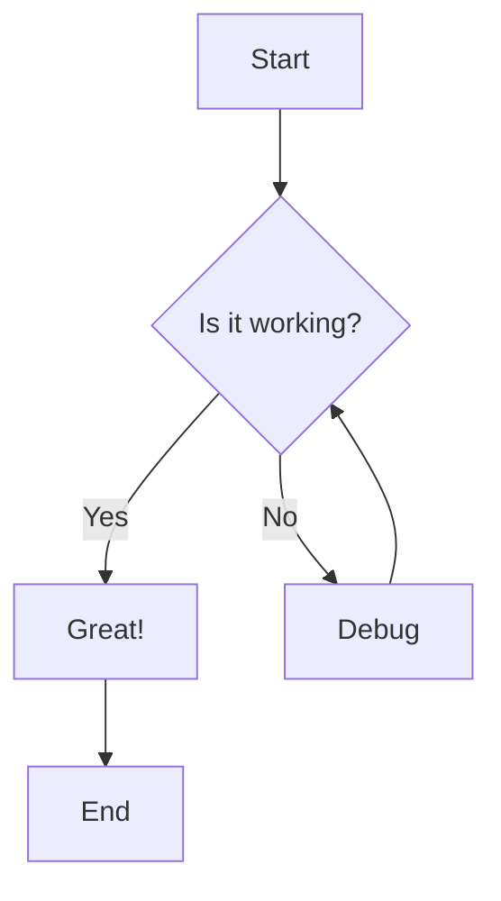
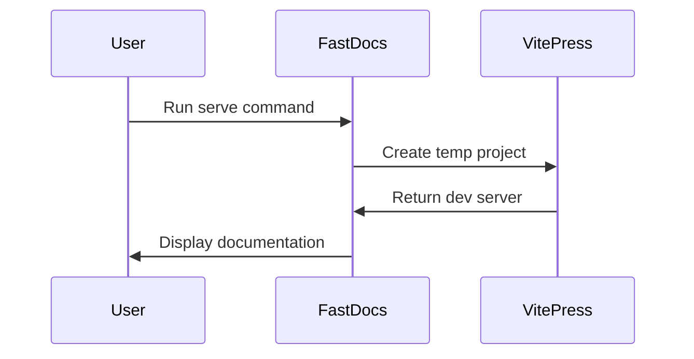
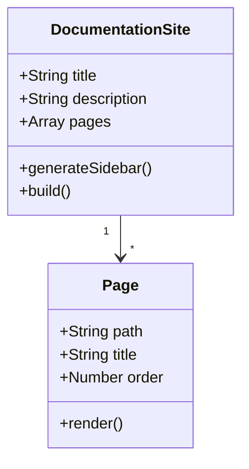
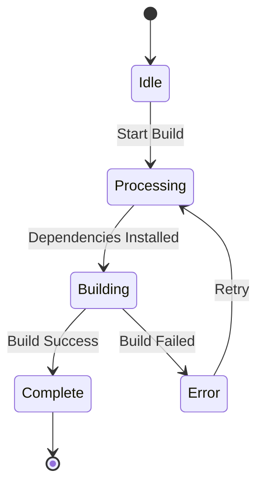
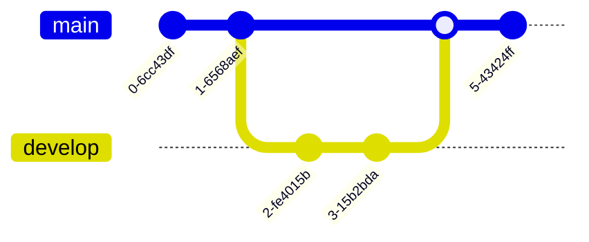
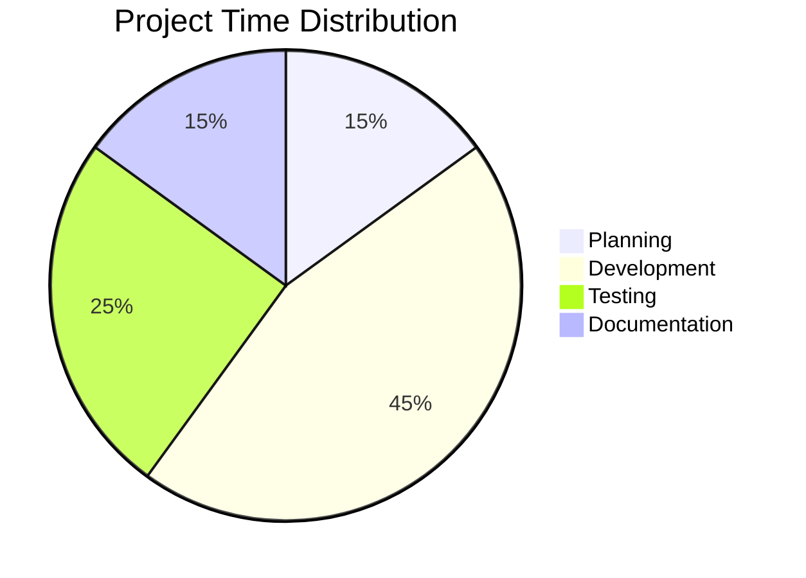

# Mermaid Diagrams

FastDocs includes built-in support for Mermaid diagrams, allowing you to create flowcharts, sequence diagrams, and other visualizations directly in your markdown files.

## Flowchart Example

## Sequence Diagram

## Class Diagram

## State Diagram

## Git Graph

## Pie Chart

## Resources

- [Mermaid Official Documentation](https://mermaid.js.org/)
- [Live Mermaid Editor](https://mermaid.live/)
- [Mermaid Syntax Reference](https://mermaid.js.org/intro/syntax-reference.html)

