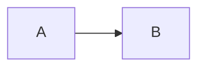
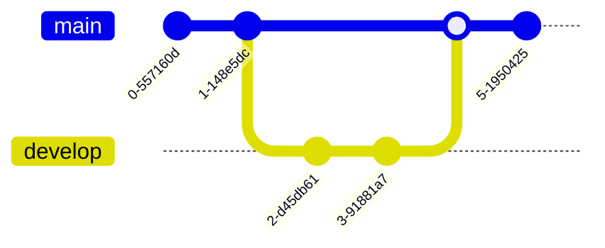
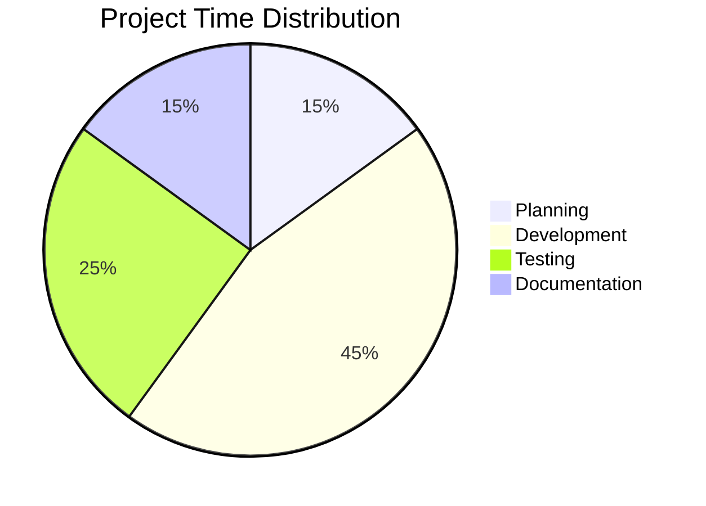

# Test Mermaid

## Simple Test

```mermaid
graph LR
    A --> B
```

## Git Graph Test

```mermaid
gitGraph
    commit
    commit
    branch develop
    checkout develop
    commit
    commit
    checkout main
    merge develop
    commit
```

## Pie Chart Test

```mermaid
pie title Project Time Distribution
    "Planning" : 15
    "Development" : 45
    "Testing" : 25
    "Documentation" : 15
```
